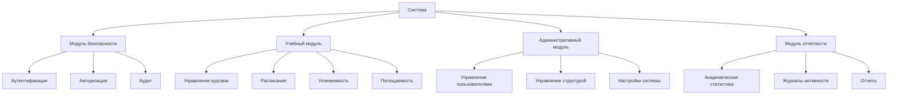

# Лабораторная работа №4 - Архитектура системы управления университетом


## Часть 1 - Программная архитектура

### 1.1 Структура базы данных

#### Основные сущности:

1. **Пользователи и роли**:
```sql
CREATE TABLE users (
    id int NOT NULL AUTO_INCREMENT,
    username varchar(50) NOT NULL,
    email varchar(100) NOT NULL,
    first_name varchar(50) NOT NULL,
    last_name varchar(50) NOT NULL,
    is_active tinyint(1) DEFAULT '1',
    PRIMARY KEY (id)
);

CREATE TABLE roles (
    id int NOT NULL,
    name varchar(50) NOT NULL,
    description text,
    created_at timestamp NULL DEFAULT CURRENT_TIMESTAMP
);

CREATE TABLE user_roles (
    user_id int NOT NULL,
    role_id int NOT NULL,
    role_type enum('primary','secondary') NOT NULL DEFAULT 'primary'
);
```

2. **Организационная структура**:
```sql
CREATE TABLE faculties (
    id int NOT NULL AUTO_INCREMENT,
    name varchar(255) NOT NULL,
    short_name varchar(50) DEFAULT NULL,
    description text,
    PRIMARY KEY (id)
);

CREATE TABLE departments (
    id int NOT NULL AUTO_INCREMENT,
    faculty_id int NOT NULL,
    name varchar(255) NOT NULL,
    head_user_id int DEFAULT NULL,
    PRIMARY KEY (id)
);

CREATE TABLE groups (
    id int NOT NULL,
    name varchar(50) NOT NULL,
    faculty varchar(100) NOT NULL,
    year_of_study int NOT NULL,
    curator_id int DEFAULT NULL,
    department_id int DEFAULT NULL
);
```

3. **Учебный процесс**:
```sql
CREATE TABLE courses (
    id int NOT NULL,
    name varchar(100) NOT NULL,
    code varchar(20) NOT NULL,
    teacher_id int DEFAULT NULL,
    credits int NOT NULL,
    semester int NOT NULL,
    hours int NOT NULL DEFAULT '0'
);

CREATE TABLE lessons (
    id int NOT NULL,
    course_id int NOT NULL,
    teacher_id int NOT NULL,
    group_id int NOT NULL,
    type enum('lecture','practice','consultation','exam') NOT NULL,
    topic varchar(255) NOT NULL,
    date date NOT NULL,
    start_time time NOT NULL,
    end_time time NOT NULL,
    room varchar(50) NOT NULL
);

CREATE TABLE attendance (
    id int NOT NULL AUTO_INCREMENT,
    lesson_id int NOT NULL,
    student_id int NOT NULL,
    status enum('present','absent','late') NOT NULL,
    date date NOT NULL,
    type enum('lecture','practice','lab','exam') NOT NULL
);
```

### 1.2 Структура модулей системы



### 1.3 Основные процессы системы

1. **Управление учебным процессом**:
```sql
-- Пример запроса для получения расписания преподавателя
SELECT 
    l.date,
    l.start_time,
    l.end_time,
    c.name as course_name,
    g.name as group_name,
    l.room,
    l.type
FROM lessons l
JOIN courses c ON l.course_id = c.id
JOIN groups g ON l.group_id = g.id
WHERE l.teacher_id = ? AND l.date >= CURRENT_DATE
ORDER BY l.date, l.start_time;

-- Пример запроса для анализа успеваемости
SELECT 
    s.first_name,
    s.last_name,
    c.name as course_name,
    AVG(g.grade) as average_grade,
    COUNT(DISTINCT a.id) as attendance_count
FROM students s
JOIN grades g ON s.id = g.student_id
JOIN courses c ON g.course_id = c.id
LEFT JOIN attendance a ON s.id = a.student_id
WHERE g.course_id = ?
GROUP BY s.id, c.id;
```

2. **Система безопасности**:
```sql
-- Аудит действий пользователей
CREATE TABLE activity_log (
    id int NOT NULL,
    user_id int DEFAULT NULL,
    action varchar(100) NOT NULL,
    entity_type varchar(50) NOT NULL,
    entity_id int DEFAULT NULL,
    details text,
    ip_address varchar(45) DEFAULT NULL,
    category enum('academic','administrative','system') NOT NULL,
    importance enum('low','medium','high') NOT NULL DEFAULT 'low'
);

-- Управление сессиями
CREATE TABLE sessions (
    id varchar(128) NOT NULL,
    user_id int DEFAULT NULL,
    ip_address varchar(45) DEFAULT NULL,
    user_agent text,
    payload text,
    last_activity timestamp NULL DEFAULT NULL
);
```

## Часть 2 - Технологическая архитектура

### 2.1 Серверные компоненты

1. **Веб-сервер**:
- Apache 2.4+
- PHP 7.4+
- Модули:
  - mod_rewrite
  - mod_ssl
  - php_mysql
  - php_mbstring

2. **База данных**:
- MySQL 8.0+
- InnoDB engine
- UTF-8 кодировка
- Оптимизированные индексы

3. **Система кэширования**:
- Redis/Memcached
- Кэширование сессий
- Кэширование запросов

### 2.2 Клиентская часть

1. **Требования к браузеру**:
- Chrome 80+
- Firefox 75+
- Safari 13+
- Edge 80+

2. **JavaScript библиотеки**:
- jQuery 3.6+
- Bootstrap 5+
- DataTables
- Chart.js

### 2.3 Безопасность

1. **Аутентификация**:
- Bcrypt хеширование
- Защита от брутфорса
- Двухфакторная аутентификация

2. **Защита данных**:
- HTTPS
- CSP (Content Security Policy)
- XSS protection
- CSRF tokens

3. **Мониторинг**:
- Логирование действий
- Отслеживание попыток взлома
- Backup системы

## Заключение

Реализованная архитектура обеспечивает:
1. Высокую производительность
2. Масштабируемость системы
3. Надежную защиту данных
4. Удобство разработки и поддержки

Система построена с использованием современных технологий и практик разработки, что обеспечивает её эффективность и долговечность. 